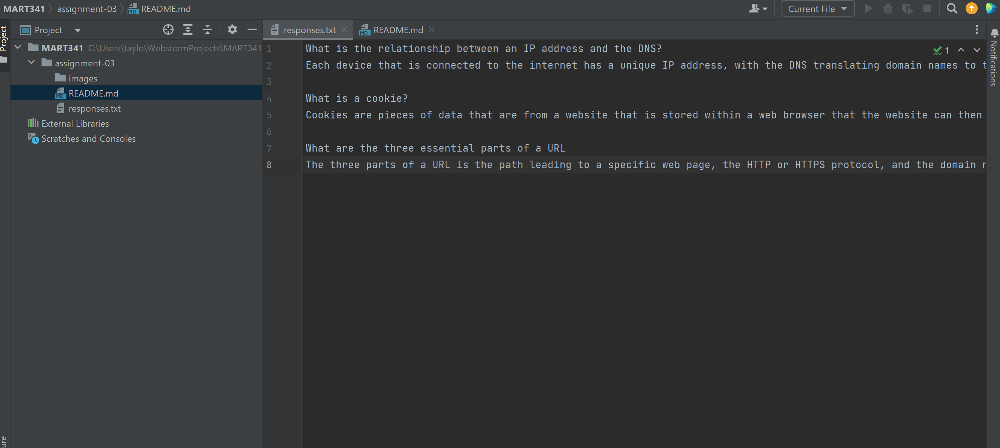

<h1>Read me file</h1>
Three things I have learned so far:
<ul>
<li>Nice refresher to HTML/setting up a Github repository</li>
<li>Refresher on IP and DNS, cookies, and URLS</li>
<li>Steps that are good to follow for building websites.</li>
</ul>

<a href="responses.txt">Responses</a>
