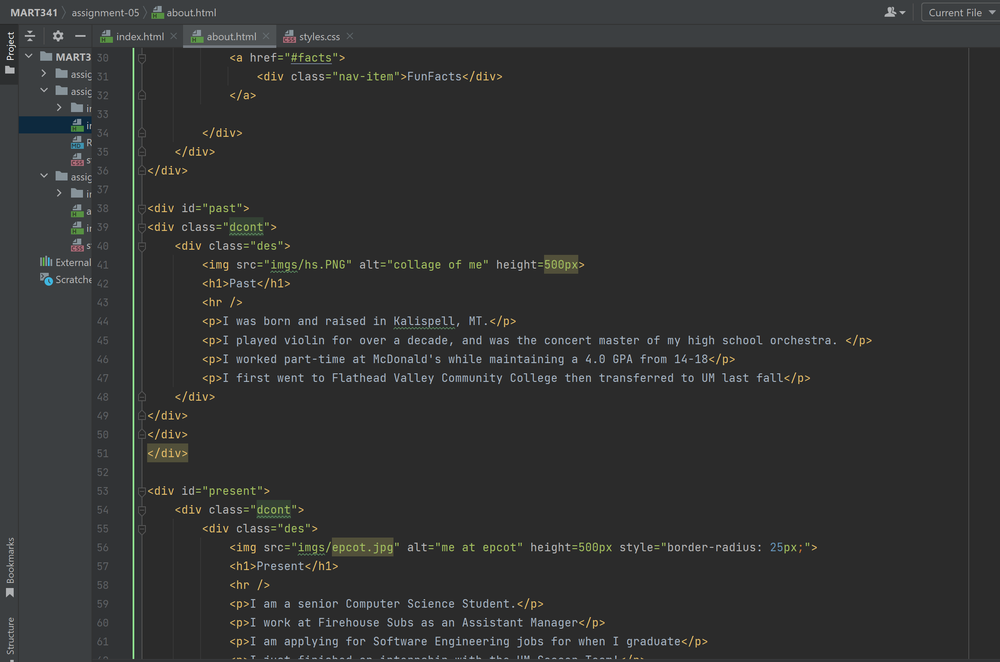

Tell me about a website you visited using The Wayback Machine. What year was it from? How is the older version different from the new version in terms of its overall design?
I visited Facebook back in 2006! It is very different from the design it has today, and overall it seems less dynamic and responsive. It also has a more 'blocky' feel that older purely HTML (without bootstrap, etc.) pages have. 

Link to your screenshot using a relative URL. (Just like we've done in the last few weeks!)
