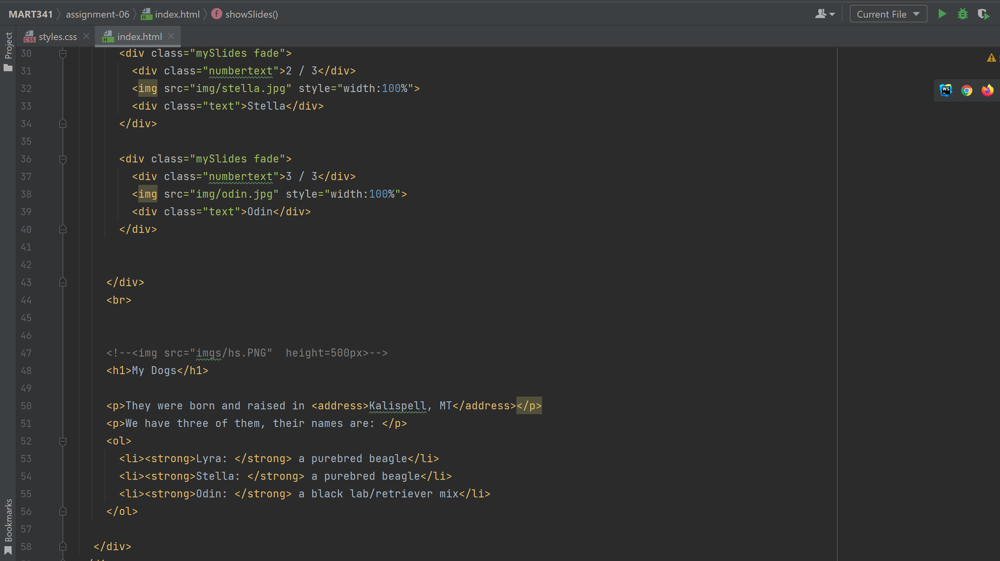

Difference between semantic and structural markup

Structural markup is markup that structures the page layout i.e. div with CSS renders child elements in a certain structure, while semantic markup is where the name of the tag indicates something about the content i.e. ul indicates an unordered list.

Link to your screenshot using a relative URL. (Just like we've done in the last few weeks!)
