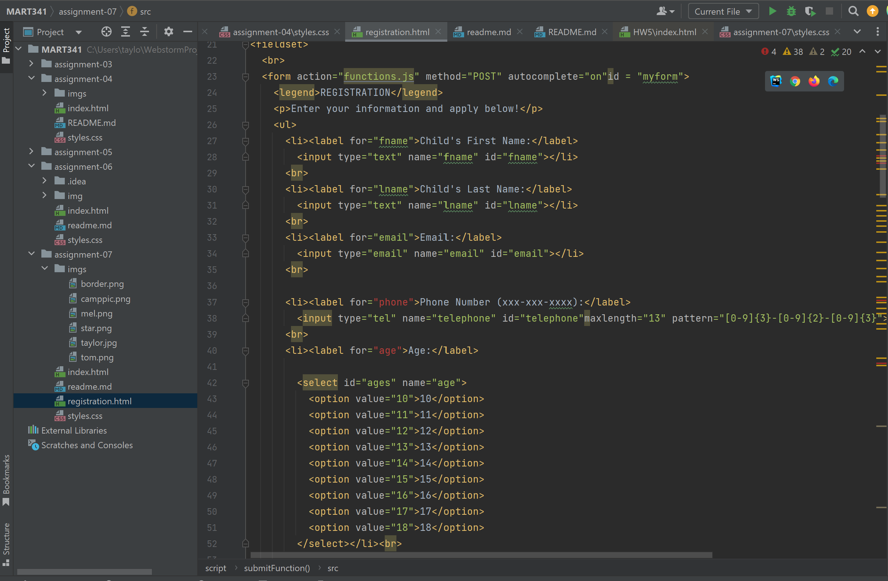

Please describe any forms you've come across while browsing the web. What purposes do they serve?
I've come accross credit card/payment information forms, contact forms, and registration forms! They pretty much stand for what they are doing, whether running information for payment, getting contact information, etc.

