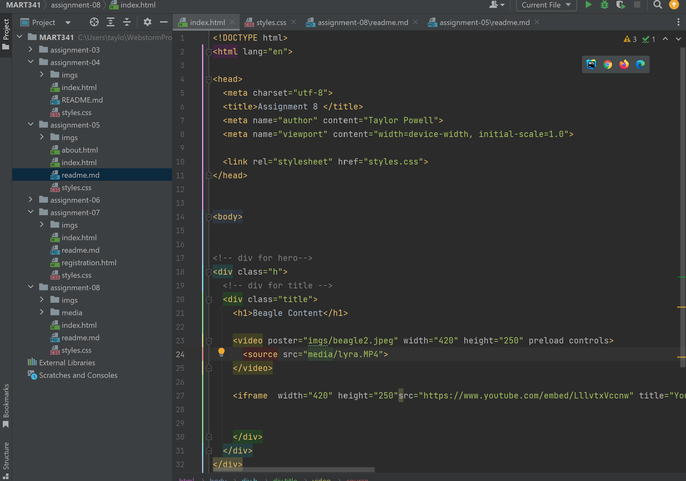

What is an affordance?
An affordance is a possibility of an action of an object. Like a stair affords being stepped on, or a chair affords being sat on.

What are the advantages and disadvantages of using a third-party service like YouTube or Vimeo to host your videos?
Advantages are having ease of uploading and sharing your content with the world. Some downsides are ads that can obscure your content and generally your content is competing with thousands of others.

Optional: What challenges did you face this week with this assignment? How did you overcome them?
I struggled a bit with getting my own video of my dog on here. I think it was just not sending accurately.

