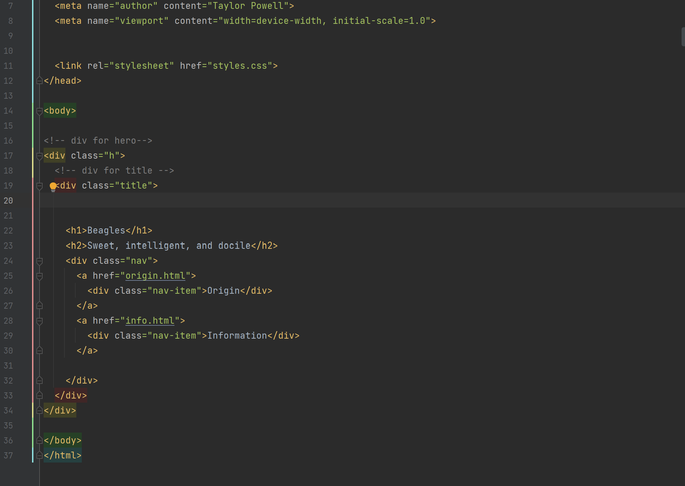

Briefly recap your experience learning HTML. What was old, new, interesting, or difficult to learn?
I was revisiting JQuery this week and it was a challenge to get some stuff to work! Otherwise, it was fun to make a website themed towards my favorite breed of dog.

After we come back from spring break we will start to dive into CSS and expand on styling, which helps us "decorate" HTML. Is there anything you're anxious or excited to learn about in this new section?

I want to be able to format and make my stylesheets 'cleaner' they always seem so cluttered!

