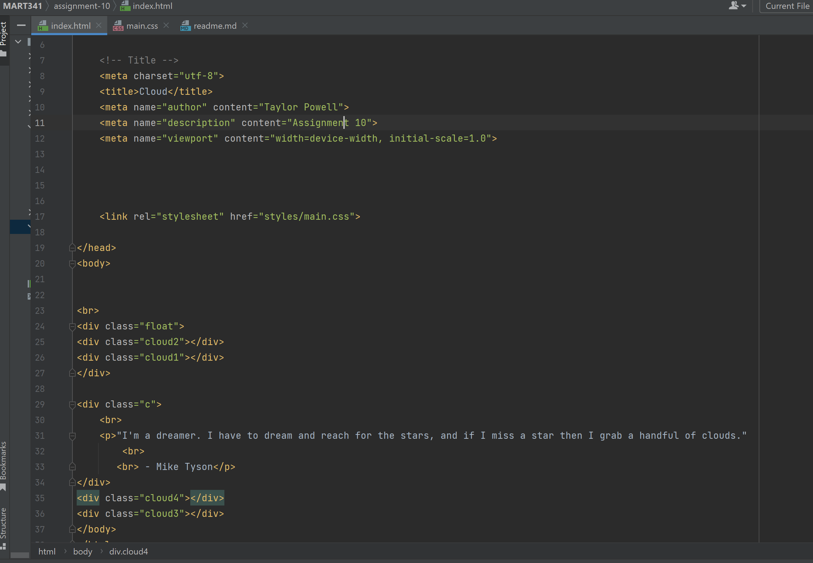

Describe the difference between the universal, element, class, and id selector types. When might you choose one over the other to style content?
ID selectors are used to identify a single element in our HTML, while the class can identify more than one element. The universal selector selects every element in the HTML document. The element selector selects all elements with the specified name.

Discuss your color palette. How did you choose your colors?
I really enjoy pastel blues/purple and I wanted to do a palette with those colors. I then chose a cloud theme because that works with those colors well.

