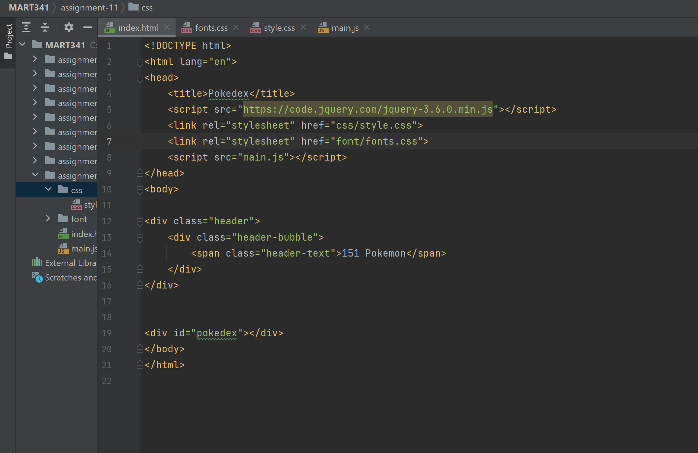

Typography is differences between styles of text that give them unique appearances.
Font fallbacks are important because in the case the primary font isn't loaded/working, that font face will show instead.
Web safe fonts are typefaces that are generally pre-installed on most devices. A web font is a font used in a website that isn't installed by default. A system font is one that is also already assumed to be on the majority of user's devices, so it does not need to be downloaded.
