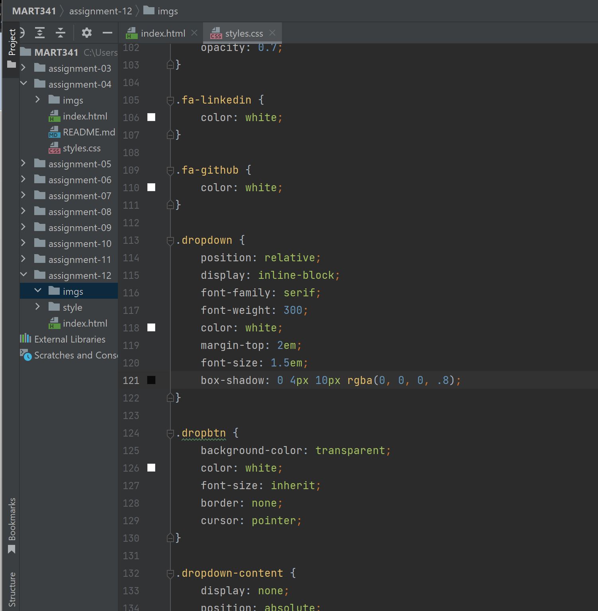

What is the difference between padding, margin, and borders?
Padding is the space between the content and the border of the box. Margin is the outer space surrounding the box, and finally the border is the perimeter of the box.

Optional: how did this week's assignment go? What challenges did you face, and how did you overcome them?
The assignment went okay and I didn't have any specific struggles :)

